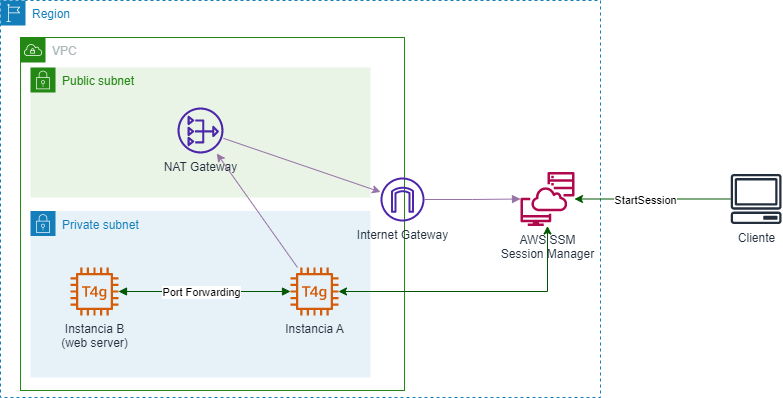

# **Port Forwarding con AWS Systems Manager Session Manager**
En este repositorio se prueba el funcionamiento de un tunel SSH con Port Forwarding mediante AWS SSM Session Manager. Para ello, se crearán dos instancias EC2 en subredes privadas, tras un NAT Gateway. Una de las instancias (instancia A), se utilizará para realizar un túnel SSH para conectar a un servicio HTTP alojado en la segunda instancia (instancia B).

La arquitectura propuesta quedaría como sigue:

## **Requerimientos**

* Una cuenta de AWS con AWS CLI configurado

## **Instrucciones**

1. Se establece la región donde se creará la infraestructura (cambiar el valor de la variable de entorno por el apropiado):
        
        REGION=us-east-2

2. Se crea un bucket de Amazon S3 donde se almacenarán los archivos necesarios para el despliegue (cambiar el nombre del bucket por el apropiado). AWS CloudFormation utilizará dicho bucket.

        aws s3 mb s3://cloudformation-us-east-2-jevs --region $REGION
        BUCKET=cloudformation-us-east-2-jevs

3. Empaquetar la plantilla de AWS CloudFormation:

        aws cloudformation package --template-file port-forwarding.yaml --s3-bucket $BUCKET --output-template-file port-forwarding-transformed.yaml --region $REGION

4. Desplegar la plantilla de AWS CloudFormation:

        aws cloudformation deploy --template-file port-forwarding-transformed.yaml --stack-name port-forwarding-stack --capabilities CAPABILITY_IAM --region $REGION

5. Se obtiene el ID de la instancia A:

        id1=$(aws cloudformation describe-stacks --stack-name port-forwarding-stack --query 'Stacks[0].Outputs[?OutputKey==`Id1`].OutputValue' --output text --region $REGION)

6. Se obtiene la IP de la instancia B:

        ip2=$(aws cloudformation describe-stacks --stack-name port-forwarding-stack --query 'Stacks[0].Outputs[?OutputKey==`Ip2`].OutputValue' --output text --region $REGION)

7. Tras unos minutos, la pila de recursos se habrá creado. Ahora sólo será necesario crear una sesión contra la instancia A desde AWS SSM Session Manager que actuará como túnel SSH contra el puerto 80 de la instancia B. Para ello es necesario que en la máquina local se haya instalado previamente el plugin de AWS SSM Session Manager (https://docs.aws.amazon.com/systems-manager/latest/userguide/session-manager-working-with-install-plugin.html). El túnel SSH mapeará el puerto 10000 local al puerto 80 de la instancia B a través de la instancia A. Para ello, se indicará a AWS SSM Session Manager que al iniciar la sesión se ejecute un automatismo que cree el túnel, que se parametrizará con los valores anteriores:

        aws ssm start-session --target $id1 --document-name AWS-StartPortForwardingSessionToRemoteHost --parameters "portNumber"=["80"],"localPortNumber"=["10000"],"host"=[$ip2] --region $REGION

8. Por último, sólo resta abrir un navegador o cliente HTTP y acceder a la URL:

        curl http://localhost:10000
